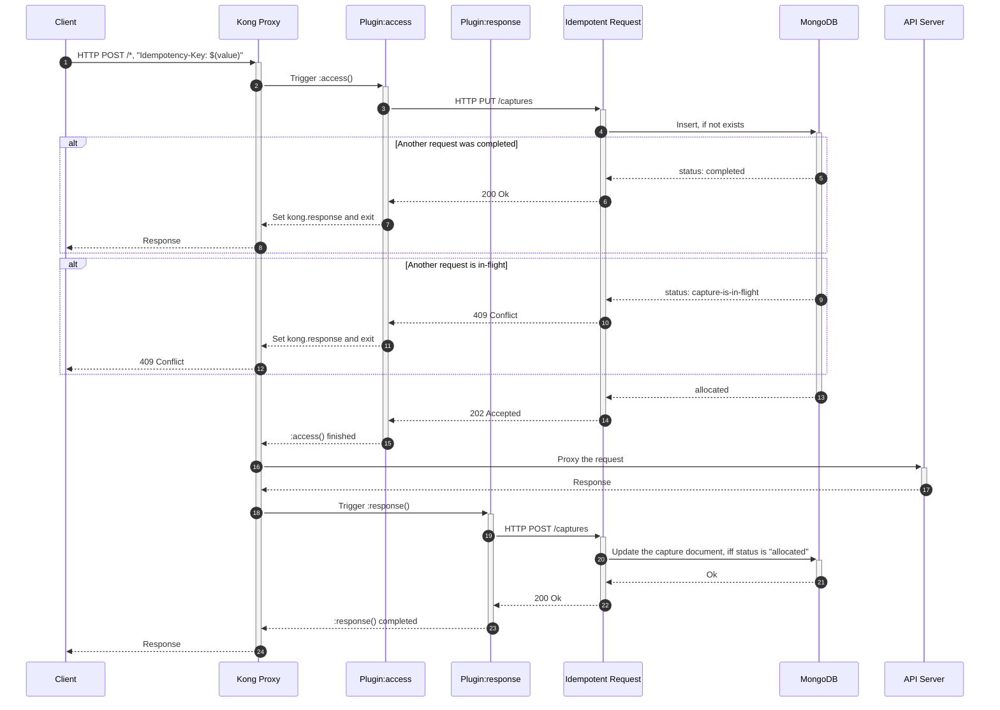

# Idempotent Request Service v2

Idempotent Request Service follows behaviors described in [IETF draft for standardized `Idempotency-Key` header](https://datatracker.ietf.org/doc/html/draft-ietf-httpapi-idempotency-key-header-00).

## Sequence



## MongoDB: Insert, if not exists

MongoDB supports `upsert` operations, i.e. it would create a new document, if lookup does not return results, or it would update existing one. 

There are 2 ways to achieve the same result: 
1. [`findOneAndUpdate` with `upsert` option](https://docs.mongodb.com/manual/reference/method/db.collection.findOneAndUpdate/#update-document-with-upsert).
2. [`findAndModify` with `upsert` option](https://docs.mongodb.com/manual/reference/method/db.collection.findAndModify/#upsert).

Both operations must be executed with `upsert` and `$setOnInsert`.

```shell
db.people.findOneAndUpdate(
    { id: "$(account-id)-$(idempotency-key)" },
    { $setOnInsert: { status: "in-flight" }},
    { upsert: true, returnNewDocument: false }
);
  
# or

db.people.findAndModify({
    query: { id: "$(account-id)-$(idempotency-key)" },
    update: { $setOnInsert: { status: "in-flight" }},
    upsert: true,
    new: false
});
```